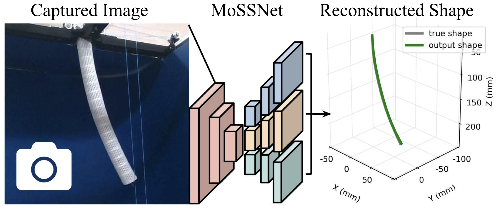
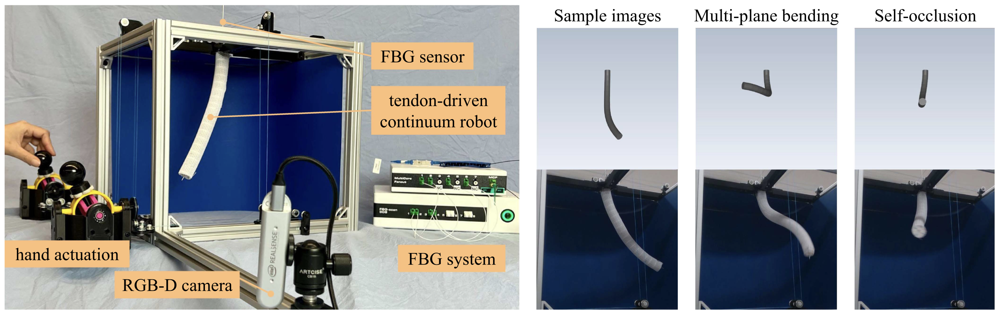

# MoSSNet: Monocular Shape Sensing for Continuum Robots



MoSSNet is an eye-to-hand monocular approach to continuum robot shape sensing. Utilizing a deep encoder-decoder network, MoSSNet achieves accurate and real-time shape sensing without fiducial markers, manual segmentation, or camera calibration.

Authors: [Chengnan Shentu*](https://www.cs.toronto.edu/~cshentu/), [Enxu Li*](https://www.cs.toronto.edu/~tli/), Chaojun Chen, Puspita Triana Dewi, [David B. Lindell](https://davidlindell.com/), [Jessica Burgner-Kahrs](https://crl.utm.utoronto.ca/jbk/)

IEEE Robotics and Automation Letters (RA-L)

https://ieeexplore.ieee.org/abstract/document/10372078

https://arxiv.org/abs/2303.00891


## Requirements and Installation
Our implementation is based on python 3.7 and Cuda 11.1. Tested on Ubuntu 22.04.
```
git clone https://github.com/ContinuumRoboticsLab/MoSSNet.git
cd MoSSNet
pip install -r requirements.txt
```

## Datasets and Checkpoints



Our dataset is based on a 2 segment tendon-driven continuum robot (TDCR) that is 250mm in length. You can view sample data in `/MoSSNet/dataset_sample`.

|Dataset Name |#Shapes |Zip File Size |Link |
|------|------------|--------------|------|
|MoSS-Sim|50k |1.4G | [[OneDrive]](https://utoronto-my.sharepoint.com/:u:/g/personal/c_shentu_mail_utoronto_ca/EfWiStv0YXlDt2NEKzOwWwMBM81VfcfR86toNCk9Tzxthw?e=LlbSyK) [[GoogleDrive]](https://drive.google.com/file/d/1LnaJ163XRMs5OV5XPsKFxZpPk61poEX2/view?usp=sharing)
|MoSS-Real|17.5k |18.3G|[[OneDrive]](https://utoronto-my.sharepoint.com/:u:/g/personal/c_shentu_mail_utoronto_ca/EZqeXpHhr4pNrFYJL18OBC8BT7Bgi_zEsXEEmMoXplikYA?e=EN0dNf) [[GoogleDrive]](https://drive.google.com/file/d/1gKxqibJO59_G7BHbMhWp5NvqQMnlo1LE/view?usp=sharing)
|Disturbed-Real|5.1k |5.3G|[[OneDrive]](https://utoronto-my.sharepoint.com/:u:/g/personal/c_shentu_mail_utoronto_ca/EVevSF1liI5AjrpUv-8w0_IBlkZvBbKqPVR_Y_xqXHOCig?e=kbcSBP) [[GoogleDrive]](https://drive.google.com/file/d/1hDAhjqQjQQIbhwR7Pvgyf4am1IdQ6X4X/view?usp=sharing)

*If a link has expired, you can send us an email at `cshentu@cs.toronto.edu` and we'll fix it ASAP.

|Checkpoint Name|Training Set|Zip File Size |Link|
|---------------|------------|--------------|----|
|checkpoint_mossnet_sim|MoSS-Sim/train|0.15G|[[OneDrive]](https://utoronto-my.sharepoint.com/:u:/g/personal/c_shentu_mail_utoronto_ca/EQOBE24SaulBpzpNgggFgTsByHqP4LQZwof6JmC7QFg7Qw?e=pc9pS5) [[GoogleDrive]](https://drive.google.com/file/d/1BnfXUKLjkq3FHwMEfBFjzbSAzA3gQtdy/view?usp=sharing)
|checkpoint_mossnet_real|MoSS-Real/train|0.15G|[[OneDrive]](https://utoronto-my.sharepoint.com/:u:/g/personal/c_shentu_mail_utoronto_ca/EUQDvqYc7SNOt0Ko9IagJokBgfoiGjLFT3d6wp4620hxkQ?e=qOytWk) [[GoogleDrive]](https://drive.google.com/file/d/1SxDlD0BTiPnhTiGqRIE85AT5l86qXG4j/view?usp=sharing)

---

The datasets are already split with 60-15-25 train-validation-test ratio. You can merge the folders and re-split using the commands below.
```
python generate_splits.py -d /path_to_repo/dataset/MoSS-Sim
python generate_splits_real.py -d /path_to_repo/dataset/MoSS-Real
```


## Training

### Example Training command 
```
python trainer.py -c moss_sim [-p logs/moss_sim/model_best.pth.tar]
```
You can add more config `yaml` files in `./cfg` and replace `-c moss_sim` with `-c xxx` after adding `xxx.yaml`. You can use the `-p` flag to train from a previous checkpoint.

### Example Training command using debug mode
This setting will only train and eval 100 iterations every epoch to debug model
```
python trainer.py -c moss_sim --debug
```

## Inference
### Example inference command 
```
python evaluator.py -l /logs/moss_sim [-c alternative_checkpoint]
```
The evaluator follows the config file generated in the log folder during training. By default it will evaluate the model on the validation set. You can modify the `logs/log_name/cfg.yaml` file to evaluate on the test set for example. 

### Using our checkpoints
Unzip the checkpoints into `MoSSNet/logs`. 
```
python evaluator.py -l /logs/checkpoint_mossnet_sim
python evaluator.py -l /logs/checkpoint_mossnet_real
```
We have modified the `cfg.yaml` files to evaluate on the test set of **MoSS-Sim** and **MoSS-Real** respectively. In the `cfg.yaml` file for the real checkpoint, if you change the eval base path to `dataset/Disturbed-Real`, the **Disturbed-Real** test set will be used instead. You should see the same results as Table 2 in our paper (fps will depend on compute hardware).

## Citation
If you find our paper and code useful in your research, please consider giving a star and citation :D

      @article{shentu2024moss,
      author={Shentu, Chengnan and Li, Enxu and Chen, Chaojun and Dewi, Puspita T. and Lindell, David B. and Burgner-Kahrs, Jessica},
      journal={IEEE Robotics and Automation Letters}, 
      title={MoSS: Monocular Shape Sensing for Continuum Robots}, 
      year={2024},
      volume={9},
      number={2},
      pages={1524-1531},
      doi={10.1109/LRA.2023.3346271}}
